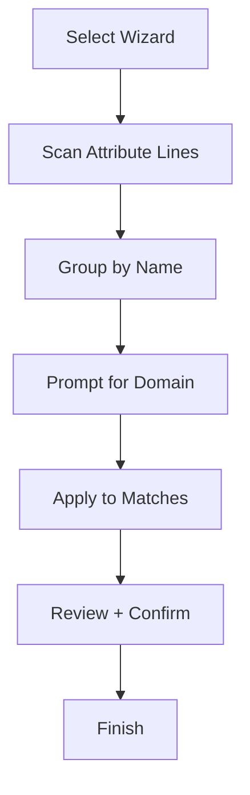

# Whiteboard Diagram Specification

**Status**: Draft  
**Last Updated**: 2026-02-05

---

## Purpose

Defines the data model, UI behaviors, serialization, and interaction rules for ScratchRobin whiteboard diagrams. Whiteboards are free‑form canvases for early ideation and brainstorming that can later be formalized into ERD or Silverston diagrams.

---

## 1. Data Model

### 1.1 Whiteboard Document

- `version`
- `board_id`
- `title`
- `metadata` (created_at, updated_at, author)
- `canvas` (width, height, background)
- `layers` (ordered list)

### 1.2 Layer

- `id`
- `name`
- `visible`
- `locked`
- `elements` (objects, shapes, notes, connectors)

### 1.3 Elements

**Common fields**:
- `id`
- `type`
- `position` (x, y)
- `size` (w, h)
- `rotation`
- `style` (fill, stroke, font, opacity)

**Element types**:
- Text
- Sticky Note
- Shape (rectangle, ellipse, line, arrow)
- Freehand Stroke
- Image
- Card (typed object)
- Connector (link between elements)

### 1.4 Typed Cards (Structured Objects)

Typed cards allow light structure while staying informal. Supported types:
- Database
- Schema
- Table
- View
- Procedure
- Function
- Trigger
- Index
- Datastore
- Server
- Cluster
- Generic

Cards have:
- `header` (type + name)
- `body` (free‑form text)
- optional `icon`

**Free‑form Attribute Lines with Hints**

Typed cards may include attribute lists in the body as free‑form lines. Attributes can include lightweight hints to signal semantics without requiring full typing:

- Example: `Surrogate_Key(pk,nn)`
- Example: `Customer_ID(fk)`

Supported hint tokens (initial set):
- `pk` (primary key)
- `fk` (foreign key)
- `nn` (not null)
- `uq` (unique)
- `idx` (indexed)

---

## 2. UI Behaviors

### 2.1 Creation

- New whiteboard starts with a blank canvas and one default layer.
- Users can add elements from a palette.

### 2.2 Editing

- Double‑click text to edit.
- Drag to move; resize handles on selection.
- Shift‑drag to constrain shape proportions.

### 2.3 Layers

- Layers can be reordered, hidden, locked.
- Locked layers are visible but not editable.

### 2.4 Snapping and Alignment

- Optional grid snapping (configurable size).
- Alignment guides for equal spacing.

### 2.5 Domain Wizard (Progressive Enrichment)

A domain wizard helps convert repeated attribute names into named domains:

- Scans all typed cards for matching attribute names.
- Detects shared columns (e.g., `Surrogate_Key` across multiple tables).
- Prompts for domain creation:
  - Domain name
  - Type (optional at early stages)
  - Constraints
- Applies the domain mapping to all matching attributes.

The wizard can be re‑run at any time to refine or merge domains.

**UX Flow (ASCII)**

```text
[Select Wizard] → [Scan Attribute Lines]
        ↓                 ↓
 [Group by Name] → [Prompt for Domain]
        ↓                 ↓
 [Apply to Matches] → [Review + Confirm]
        ↓
     [Finish]
```


**UX Flow (Mermaid)**



**UX Flow (SVG)**


---

## 3. Serialization Format

**File Extension**: `.sbwb`

```json
{
  "version": "1.0",
  "board_id": "uuid",
  "title": "Customer Onboarding",
  "metadata": {
    "created_at": "2026-02-05T12:00:00Z",
    "updated_at": "2026-02-05T12:10:00Z",
    "author": "alice"
  },
  "canvas": {"width": 4000, "height": 3000, "background": "#FAFAFA"},
  "layers": [
    {
      "id": "layer_1",
      "name": "Ideas",
      "visible": true,
      "locked": false,
      "elements": [
        {
          "id": "card_1",
          "type": "card",
          "card_type": "table",
          "header": "TABLE: USERS",
          "body": "Surrogate_Key(pk,nn)\nEmail(uq,nn)\nCreated_At",
          "domain_hints": {
            "Surrogate_Key": "SURROGATE_KEY"
          },
          "position": {"x": 120, "y": 200},
          "size": {"w": 220, "h": 140},
          "style": {"fill": "#FFF3B0", "stroke": "#D1A300"}
        }
      ]
    }
  ]
}
```

---

## 4. Keyboard Shortcuts

| Shortcut | Action |
| --- | --- |
| `Ctrl+N` | New whiteboard |
| `Ctrl+S` | Save |
| `Ctrl+Z` | Undo |
| `Ctrl+Y` | Redo |
| `Delete` | Delete selected |
| `Ctrl+G` | Toggle grid |
| `Ctrl+L` | Lock/unlock layer |

---

## 5. Round‑Trip Rules

### 5.1 Whiteboard → ERD

- Typed cards can be converted into draft entities.
- Conversion is explicit via “Convert to Drafts.”
- Freehand notes are not converted.
- Attribute hints (`pk`, `fk`, `nn`) are mapped to ERD semantics.
- If a domain mapping exists, the domain is applied during conversion.

### 5.2 ERD → Whiteboard

- ERD elements may be imported as read‑only cards for discussion.

---

## 6. Printing and Export

- Export formats: PNG, SVG, PDF.
- Export options: full canvas, viewport, or selection.
- Layers can be included/excluded in export.

---

## 7. Edge Cases

- Large canvases must use tiled rendering.
- If an image is missing, show placeholder with file name.
