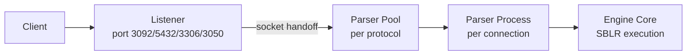

# ScratchBird Network Listener and Parser Pool Specification

Version: 1.0
Status: Draft (Alpha scope)
Last Updated: January 2026

## Purpose

Define how the server starts and manages network listeners, how each listener
creates and maintains parser pools, and how client connections are routed to
the correct parser without trusting the client or the parser. This document
is the authoritative behavior for listener startup, connection handoff, and
parser pool lifecycle for Alpha.

## Scope and Non-Goals

In scope:
- One listener per supported protocol (ScratchBird native, PostgreSQL, MySQL,
  Firebird). Each listener manages its own parser pool.
- Server startup, cleanup of stale listeners, and controlled listener shutdown.
- Parser pool sizing, pre-warming, health checks, and recycling policy.
- Socket handoff from listener to parser and control-plane metadata exchange.
- Configuration schema and examples for listener and parser pool behavior.

Out of scope:
- Cluster listener coordination (Beta).
- TDS/MSSQL listener (post-gold).
- Remote database UDR connection pools (see `Alpha Phase 2/11-Remote-Database-UDR-Specification.md`).
- Legacy Y-Valve router implementation (superseded; see core/Y_VALVE_ARCHITECTURE.md).

## Terminology

- Listener: The process or thread that accepts network connections on a port.
- Parser: The per-connection process that speaks a specific protocol and
  translates SQL to SBLR.
- Parser pool: A pool of pre-started parser workers for one protocol.
- Handoff: The transfer of an accepted socket from listener to parser.
- Control plane: Listener control channels (spawn, health, metrics).
- Data plane: Direct client <-> parser traffic after handoff.

## Architecture Summary

Key principles:
- The listener is untrusted and performs no SQL parsing.
- The parser is untrusted and cannot bypass engine enforcement.
- The engine is the sole authority for SBLR validation and execution.
- After handoff, data plane traffic does not pass through the listener.

## Executables and Defaults

ScratchBird uses separate listener and parser agent binaries per protocol.

Listeners:
- sb_listener_native (default enabled)
- sb_listener_pg (config-enabled)
- sb_listener_mysql (config-enabled)
- sb_listener_fb (config-enabled)

Parser agents:
- sb_parser_native
- sb_parser_pg
- sb_parser_mysql
- sb_parser_fb

Only the native listener starts by default. Emulated listeners are started
only when enabled in configuration.

### Diagram (Mermaid)



### Diagram (ASCII)

```
Client
  |
  v
Listener (protocol port)
  |
  | socket handoff
  v
Parser pool (per protocol)
  |
  v
Parser process (per connection)
  |
  v
Engine core (SBLR)
```

## Listener Model

Each enabled protocol has its own listener and parser pool. The listener:
- Binds to the configured address and port.
- Accepts connections and applies basic network policy.
- Optionally performs minimal protocol detection (if shared port is enabled).
- Hands off the socket and metadata to a parser worker.
- Tracks parser pool health and replaces failed workers.

The listener never:
- Parses SQL or generates SBLR.
- Applies authorization or access policy (engine decides).
- Rewrites queries or results.

### Dedicated vs Shared Listener

Default: Dedicated ports per protocol.
- ScratchBird native: 3092
- PostgreSQL: 5432
- MySQL: 3306
- Firebird: 3050
- TDS/MSSQL: 1433 (post-gold only)

Optional: Shared listener (single port + protocol auto-detect).
- Disabled by default in Alpha.
- If enabled, disable the dedicated native listener to avoid port conflicts.
- Uses protocol preface bytes to route to the correct parser pool.
- Must not assume protocol unless detection confidence is high.

## Parser Pool Model

Parser pool properties per protocol:
- min_size: Minimum idle workers kept warm.
- max_size: Upper bound on workers for that protocol.
- prewarm: Whether to spawn min_size at startup.
- spawn_strategy: prefork or on_demand.
- max_requests_per_parser: Recycle after N sessions.
- max_age_seconds: Recycle after time limit.
- health_check_interval_ms: Ping or heartbeat interval.
- recycle_on_error: Replace worker on crash or protocol error.

### Spawn Strategy (Alpha Default)

Options:
- prefork: pre-start min_size workers at startup
- on_demand: spawn workers only when needed
- hybrid: prefork min_size and allow on_demand up to max_size

Default: hybrid (prefork min_size + on_demand burst) for fast connect time
with process isolation.

Parser workers are single-connection. After a connection closes, the worker can
be recycled or returned to idle depending on configuration.

## Connection Lifecycle

1. Listener accepts a TCP connection.
2. Listener applies network policy (max_connections, queue limits).
3. Listener selects a parser pool based on protocol and config.
4. Listener acquires a parser worker (idle or newly spawned).
5. Listener performs socket handoff and sends metadata over a control channel.
6. Parser performs protocol handshake and authentication extraction.
7. Parser calls engine APIs; engine enforces auth and executes SBLR.
8. Parser returns results to the client and closes on session end.
9. Listener recycles or replaces parser worker based on policy.

### Connection State (Listener View)

```
ACCEPTED -> QUEUED -> HANDED_OFF -> CLOSED
                    \-> REJECTED
```

### Parser State (Worker View)

```
IDLE -> ASSIGNED -> SERVING -> IDLE or RECYCLE
```

## Socket Handoff and Metadata

Handoff must be cross-platform:
- Unix: sendmsg + SCM_RIGHTS
- Windows: WSADuplicateSocket + IPC channel

Control message (example):

```
struct ListenerHandoff {
  uint64_t connection_id;
  int socket_fd;
  char protocol[16];            // scratchbird/postgresql/mysql/firebird
  char listener_name[64];
  char client_addr[48];
  uint16_t client_port;
  bool tls_active;
  uint32_t initial_bytes_len;
  uint8_t initial_bytes[64];    // if captured for protocol detection
};
```

## Configuration

Configuration is read at server startup. Listener configuration is stored in
the main server config file and applied to each listener.

### Config Source Precedence

1. Command line flags
2. Environment variables
3. Server config file
4. Built-in defaults

### Listener Configuration Schema (YAML example)

```yaml
server:
  listeners:
    - name: native
      protocol: scratchbird
      enabled: true
      address: 0.0.0.0
      port: 3092
      max_connections: 2000
      handshake_timeout_ms: 5000
      queue_limit: 256
      queue_timeout_ms: 2000
      parser_pool:
        min_size: 4
        max_size: 64
        prewarm: true
        spawn_strategy: prefork   # prefork | on_demand
        max_requests_per_parser: 1000
        max_age_seconds: 3600
        health_check_interval_ms: 5000
        recycle_on_error: true
      tls:
        mode: required            # disabled | optional | required
        cert_path: /etc/scratchbird/tls/server.crt
        key_path: /etc/scratchbird/tls/server.key
        ca_path: /etc/scratchbird/tls/ca.crt
      auth:
        method: native            # native | kerberos | ldap | jwt
        allow_cleartext: false

    - name: postgresql
      protocol: postgresql
      enabled: true
      address: 0.0.0.0
      port: 5432
      max_connections: 1000
      parser_pool:
        min_size: 8
        max_size: 128
        prewarm: true
        spawn_strategy: prefork
      protocol_options:
        server_name: local

    - name: mysql
      protocol: mysql
      enabled: true
      address: 0.0.0.0
      port: 3306
      max_connections: 1000
      parser_pool:
        min_size: 8
        max_size: 128
        prewarm: true
        spawn_strategy: prefork

    - name: firebird
      protocol: firebird
      enabled: true
      address: 0.0.0.0
      port: 3050
      max_connections: 500
      parser_pool:
        min_size: 4
        max_size: 64
        prewarm: true
        spawn_strategy: prefork

  shared_listener:
    enabled: false
    address: 0.0.0.0
    port: 3092
    protocols: [scratchbird, postgresql, mysql, firebird]
```

Implementation note (Alpha IP layer):
- Listener binaries also accept a flattened config format:
  - `network.<protocol>_health_check_interval_ms` for per-protocol override
  - `server.health_check_interval_ms` as a global default
  - `--health-check-interval-ms` CLI override

### Connection Pooling (Engine Level)

Listener parser pools are not the same as engine connection pools. If engine
connection pooling is enabled, it must follow:
- `docs/specifications/api/CONNECTION_POOLING_SPECIFICATION.md`

## Server Startup Sequence (Listener Focus)

1. Parse command line and load server config.
2. Verify required directories and permissions.
3. Check for existing PID file.
4. If PID file exists, verify process:
   - If running, refuse to start unless force option is set.
   - If stale, remove PID file and continue.
5. Clean up stale IPC artifacts (unix socket, shared memory).
6. Load TLS configuration for parser agents.
7. Create listener instances per config.
8. Prewarm parser pools to min_size.
9. Start accept loops for each listener.
10. Emit READY status and metrics.

## Shutdown and Reload

Graceful shutdown:
- Stop accepting new connections.
- Signal parsers to drain and close.
- Enforce a timeout, then force terminate remaining parsers.
- Persist listener metrics and exit.

Reload (SIGHUP or control command):
- Re-read config.
- Add or remove listeners as needed.
- Resize parser pools without dropping active connections.
- Apply TLS and auth changes to new connections only.

## Failure Handling

- Port bind failure: listener disabled and server logs error.
- Pool exhausted: queue up to queue_limit, then reject with protocol error.
- Parser crash: replace worker and report metrics.
- Handshake timeout: close connection and recycle parser.
- Protocol mismatch (shared listener): reject with protocol error.

## Security Boundaries

- Listener and parser are untrusted; engine is authoritative.
- Parser sends SBLR to engine; engine validates and executes.
- Listener must not accept untrusted IPC peers for handoff.
- TLS termination occurs in the parser agent; listener never decrypts traffic.
- Authentication decisions are made by the engine, not the listener.

## Observability

Minimum metrics per listener:
- active_connections
- queued_connections
- accept_rate
- handshake_time_ms
- parser_pool_idle
- parser_pool_active
- parser_restarts
- protocol_errors

Log events:
- listener_start, listener_stop
- parser_spawn, parser_exit
- connection_handoff
- tls_handshake_failure
- auth_rejection (engine response)

## Compatibility Matrix (Alpha)

| Protocol | Listener | Parser Pool | Status |
| --- | --- | --- | --- |
| ScratchBird native | Yes | Yes | Alpha |
| PostgreSQL | Yes | Yes | Alpha |
| MySQL | Yes | Yes | Alpha |
| Firebird | Yes | Yes | Alpha |
| TDS/MSSQL | No | No | Post-gold |

## Related Specifications

- docs/specifications/catalog/COMPONENT_MODEL_AND_RESPONSIBILITIES.md
- docs/specifications/Alpha Phase 2/01-Architecture-Overview.md
- docs/specifications/core/Y_VALVE_ARCHITECTURE.md
- docs/specifications/network/NETWORK_LAYER_SPEC.md
- docs/specifications/wire_protocols/README.md
- docs/specifications/api/CONNECTION_POOLING_SPECIFICATION.md
- docs/specifications/Security Design Specification/01_SECURITY_ARCHITECTURE.md
