# Spec Map (Workflows → Specifications)

**Last Updated**: 2026-02-05

This diagram links core developer workflows to the specifications that define them.

```mermaid
flowchart TD
  A[Project Setup] --> B[Project Persistence]
  A --> C[Session State]
  B --> B1[PROJECT_PERSISTENCE_FORMAT]
  B --> B2[PROJECT_ON_DISK_LAYOUT]
  B --> B3[PROJECT_MIGRATION_POLICY]
  C --> C1[SESSION_STATE]
  C --> C2[SESSION_PROJECT_INTERACTION]

  D[Design Changes] --> E[Object State Machine]
  D --> F[SQL Surface]
  D --> G[DDL Generation]
  E --> E1[OBJECT_STATE_MACHINE]
  F --> F1[SCRATCHROBIN_SQL_SURFACE]
  F --> F2[Per-Manager SQL Surface]
  G --> G1[DDL_GENERATION_RULES]

  H[Git Sync] --> I[GIT Conflict Resolution]
  H --> J[Migration Generation]
  I --> I1[GIT_CONFLICT_RESOLUTION]
  J --> J1[MIGRATION_GENERATION]

  K[Deploy] --> L[Deployment Plans]
  K --> M[Rollback]
  L --> L1[DEPLOYMENT_PLAN_FORMAT]
  M --> M1[ROLLBACK_POLICY]

  N[Diagramming] --> O[ERD Modeling]
  N --> P[Serialization]
  N --> Q[Round-Trip Rules]
  O --> O1[ERD_MODELING_AND_ENGINEERING]
  P --> P1[DIAGRAM_SERIALIZATION_FORMAT]
  Q --> Q1[DIAGRAM_ROUNDTRIP_RULES]

  R[Testing & QA] --> S[Test Generation]
  R --> T[Fixtures]
  R --> U[Performance]
  S --> S1[TEST_GENERATION_RULES]
  T --> T1[TEST_FIXTURE_STRATEGY]
  U --> U1[PERFORMANCE_TARGETS]
  U --> U2[PERFORMANCE_BENCHMARKS]

  V[Security] --> W[Credential Storage]
  V --> X[Audit Logging]
  W --> W1[CREDENTIAL_STORAGE_POLICY]
  X --> X1[AUDIT_LOGGING]

  Y[Dialect Reference] --> Z[ScratchBirdSQL]
  Z --> Z1[Parser BNF]
  Z --> Z2[Alpha Dialect]
  Z --> Z3[Beta Dialect]

  AA[UI Workflow] --> AB[Dockable Workspace]
  AA --> AC[Window Model]
  AA --> AD[Keyboard Shortcuts]
  AB --> AB1[DOCKABLE_WORKSPACE_ARCHITECTURE]
  AC --> AC1[UI_WINDOW_MODEL]
  AD --> AD1[KEYBOARD_SHORTCUTS]
```

Reference index:
- `docs/specifications/INDEX.md`

Visual exports:
- `docs/specifications/SPEC_MAP.svg`
- `docs/specifications/SPEC_MAP.png`

Legend:
- `docs/specifications/SPEC_MAP_LEGEND.md`
